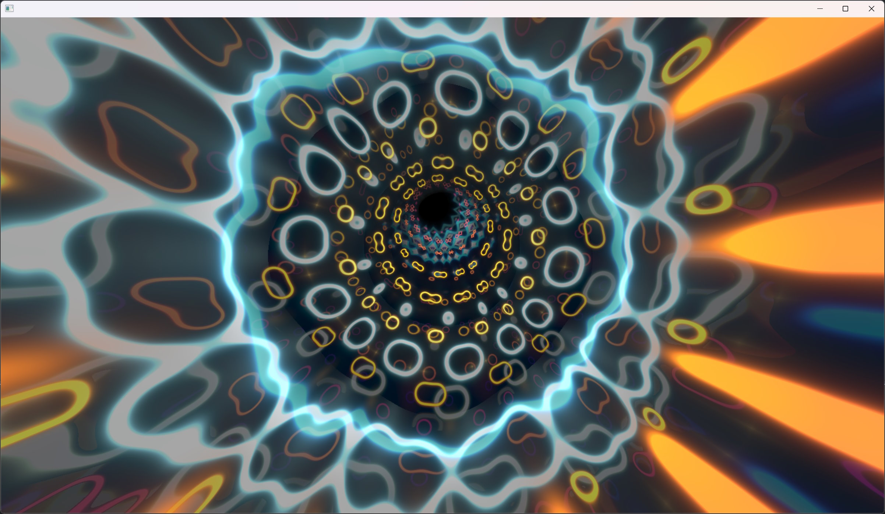

# 4KiB Windows Demo Example



This is a demonstration showcasing the utilization of lesser-known tools available on GitHub to construct tiny executables for the demo scene. While this example may not be optimal, it serves as a starting point for leveraging these tools.

I haven't divulged all the trade secrets I know, as I believe in leaving room for others to explore and discover the joy of these techniques.

Bonus: [1KiB Windows Demo Example](onek-win-demo/)

Bonus: [Straight from the book 1KiB Windows Demo](straight-from-the-book/)

## Code License: WTFPL

Unless otherwise specified, all code is licensed under the [WTFPL](http://www.wtfpl.net/).

## Music License: TBD

Music provided by Virgill as an example of using Sointu to create compact songs.

## Building

1. Open the solution in Visual Studio 2022.
2. Press Ctrl-F5.
3. It should work seamlessly!

## Tools Used to Make It Happen

### Visual Studio 2022

Download: [Visual Studio 2022](https://visualstudio.microsoft.com/downloads/)

For this example, Visual Studio 2022 serves as the primary development environment. The Community edition, available for free, offers essential tools without major licensing constraints for demo developers (as far as I can tell).

During installation, select `Desktop development with C++`.

### Crinkler

GitHub: [Crinkler](https://github.com/runestubbe/Crinkler)

Crinkler is a linker for Visual Studio that specializes in producing small binaries by implementing compression and intelligent techniques. Refer to the [manual](https://github.com/runestubbe/Crinkler/blob/master/doc/manual.txt) for fascinating insights into how Crinkler reduces program size.

> Note: Crinkler generates a detailed report named `Report.html` during the build process, providing insight into the space allocation within the final executable.

### Shader Minifier

GitHub: [Shader Minifier](https://github.com/laurentlb/Shader_Minifier)

This tool transforms bulky shader code into streamlined, easily compressible versions.

```bash
# Minify shader into "readable" format
..\shader_minifier.exe .\shader.fx --format indented -o shader_mini.fx

# Minify shader into "unreadable" format for project inclusion
..\shader_minifier.exe .\shader.fx --format c-array -o shader.inl
```

### Sointu

GitHub: [Sointu](https://github.com/vsariola/sointu)

Sointu is a music program enabling skilled musicians to create remarkable music occupying minimal space.

Developed by the talented Pestis.

```bash
# Generate assembler code from Sointu song file
..\sointu-compile.exe -arch 386 -e "h,asm" uglyverse.yml
```

### 4Klang

GitHub: [4Klang](https://github.com/hzdgopher/4klang)

Another tool for producing remarkable, compact music. However, proficiency as a musician is required.

### PPPE

Download: [PPPE](https://www.mzrst.com/)

PPPE is a program facilitating the inspection of Windows executables. It serves as a substitute for the classic `Depends.exe`, which may not function correctly anymore.

