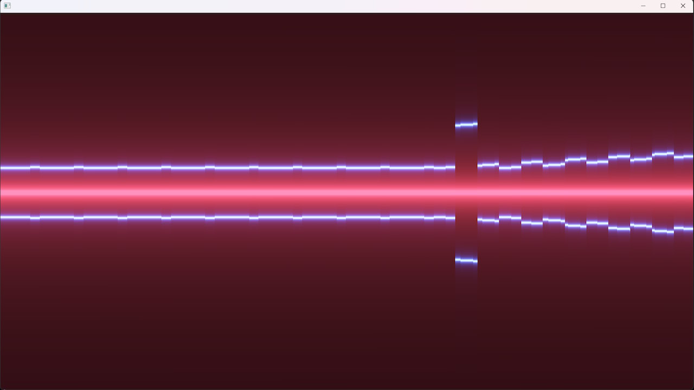

# Bonus: 1KiB Shader

In the demo "[Straight from the Book](https://demozoo.org/productions/338146/)," we generated the music within the shader and copied it into the audio buffer. The motivation behind this was that "t% funk" by [lhphr](https://www.youtube.com/@lhphr) relies on several functions not available in x86 assembler, making it difficult and size-intensive to reproduce the amazing sound.

Instead, we produced the waveform within the shader from the very first frame and then copied it to the audio buffer. Another benefit of this approach is that the waveform is then available within the shader to perform additional cool effects.

This example is not quite size-optimal and may have some glitches, but when compiled with Crinkler, the code size is reduced to 1011 bytes, qualifying it as a 1KiB demo.

Special thanks to [lhphr](https://www.youtube.com/@lhphr) for sharing the amazing formula that generates the music.